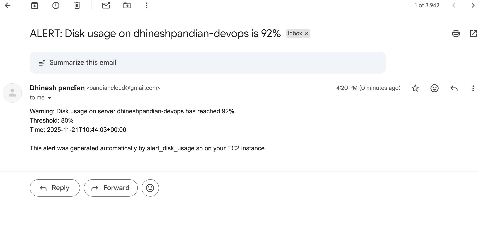

<!doctype html>
<html lang="en">
<head>
  <meta charset="utf-8" />
  <meta name="viewport" content="width=device-width,initial-scale=1" />
  <title>DevOps Intern Assignment — Powerplay</title>
  
</head>
<body>
  

    <header class="section">
      

        

          <h1>DevOps Intern Assignment — Powerplay</h1>
          
Complete implementation: EC2 setup, Nginx, monitoring, CloudWatch integration, optional SES alerts, and cleanup automation.

        

        

          
<strong>Original assignment:</strong>

          
/mnt/data/DevOps Intern Assignment - Powerplay.pdf

        

      

    </header>

    

    <section class="section">
      <h2>Overview</h2>
      
This repository implements the full assignment tasks and includes scripts to automate each step. Summary of parts:

      <ul>
        <li><strong>Part 1</strong> — System setup: create <code>devops_intern</code>, passwordless sudo, hostname. (<code>scripts/setup_part1.sh</code>)</li>
        <li><strong>Part 2</strong> — Nginx web server showing Name, Instance ID and Uptime. (<code>scripts/setup_part2.sh</code>)</li>
        <li><strong>Part 3</strong> — Monitoring script (<code>system_report.sh</code>) running via <code>systemd</code> timer; writes <code>/var/log/system_report.log</code>.</li>
        <li><strong>Part 4</strong> — Upload logs to CloudWatch Logs using the provided script.</li>
        <li><strong>Bonus</strong> — SES-based disk-usage alerts. (<code>scripts/alert_disk_usage.sh</code>)</li>
        <li><strong>Cleanup</strong> — helper script to remove installed artifacts. (<code>scripts/cleanup.sh</code>)</li>
      </ul>
    </section>

    <section class="section card">
      <h2>Architecture</h2>
      
Diagram (local copy):

      <!-- Architecture image using the uploaded local path as requested -->
      
      
If you host README on GitHub, replace the above absolute path with <code>screenshots/architecture.png</code> (the repo copy).

    </section>

    <section class="section grid">
      

        <h2>Folder structure</h2>
        <pre><code>
/
├── README.md
├── screenshots/
│   ├── PART_01.png
│   ├── PART-02.png
│   ├── PART_03.png
│   ├── PART_04.png
│   ├── SES_ALERT.png
│   └── architecture.png
├── scripts/
│   ├── setup_part1.sh
│   ├── setup_part2.sh
│   ├── system_report.sh
│   ├── system_report.service
│   ├── system_report.timer
│   ├── upload_to_cloudwatch.sh
│   ├── alert_disk_usage.sh
│   └── cleanup.sh
└── config/
    ├── cron.txt
    ├── cloudwatch-config.json
    └── ses-policy.json
        </code></pre>
      

      

        <h3>Prerequisites</h3>
        <ul>
          <li>Ubuntu 22.04 / 24.04 EC2 instance (t2.micro preferred)</li>
          <li>SSH keypair & security group (port 22 SSH, port 80 HTTP)</li>
          <li>AWS CLI v2 installed (or use an IAM role)</li>
          <li>For SES: verified sender and recipient (sandbox)</li>
        </ul>
        <h3>Required IAM permissions</h3>
        <pre><code>
logs:CreateLogGroup
logs:CreateLogStream
logs:PutLogEvents
logs:DescribeLogGroups
ses:SendEmail
ses:SendRawEmail
        </code></pre>
      

    </section>

    <section class="section">
      <h2>Usage — step by step</h2>

      <h3>Clone & prepare</h3>
      <pre><code>git clone https://github.com/YOUR_USERNAME/devops-intern-assignment.git
cd devops-intern-assignment
chmod +x scripts/*.sh</code></pre>

      <h3>Part 1 — System setup</h3>
      <pre><code>sudo bash scripts/setup_part1.sh "Your Name"</code></pre>
      
Verify as <code>devops_intern</code>:

      <pre><code>sudo su - devops_intern
hostnamectl
grep '^devops_intern:' /etc/passwd
sudo whoami    # should print 'root'</code></pre>
      
<strong>Screenshot:</strong>

      

      <h3>Part 2 — Nginx website</h3>
      <pre><code>sudo bash scripts/setup_part2.sh "Your Full Name"</code></pre>
      
Open <code>http://&lt;EC2_PUBLIC_IP&gt;</code> and verify the webpage shows your name, instance ID and uptime.

      
<strong>Screenshot:</strong>

      

      <h3>Part 3 — Monitoring & systemd timer</h3>
      <pre><code>sudo cp scripts/system_report.sh /usr/local/bin/
sudo chmod +x /usr/local/bin/system_report.sh
sudo cp scripts/system_report.service /etc/systemd/system/
sudo cp scripts/system_report.timer /etc/systemd/system/
sudo systemctl daemon-reload
sudo systemctl enable --now system_report.timer</code></pre>
      
To force entries quickly:

      <pre><code>sudo systemctl start system_report.service
sudo systemctl start system_report.service
sudo tail -n 50 /var/log/system_report.log</code></pre>
      
<strong>Screenshot:</strong>

      

      <h3>Part 4 — Upload logs to CloudWatch</h3>
      <pre><code>export AWS_REGION=us-east-1
sudo AWS_REGION=$AWS_REGION bash scripts/upload_to_cloudwatch.sh</code></pre>
      
Verify in CloudWatch Logs → Log groups → <code>/devops/intern-metrics</code>

      
<strong>Screenshot:</strong>

      
    </section>

    <section class="section card">
      <h2>Bonus — SES Disk Alert</h2>
      
Configure SES verified sender & recipient, then edit the script variables:

      <pre><code>EMAIL_FROM="your_verified_sender@example.com"
EMAIL_TO="your_verified_recipient@example.com"</code></pre>
      
Install the alert helper:

      <pre><code>sudo cp scripts/alert_disk_usage.sh /usr/local/bin/
sudo chmod +x /usr/local/bin/alert_disk_usage.sh</code></pre>
      
To test, temporarily set <code>THRESHOLD=1</code> inside the script and run:

      <pre><code>AWS_REGION=us-east-1 sudo /usr/local/bin/alert_disk_usage.sh</code></pre>
      
<strong>Screenshot (example / simulated):</strong>

      
    </section>

    <section class="section">
      <h2>Cleanup</h2>
      <pre><code>sudo bash scripts/cleanup.sh</code></pre>
      
This helper stops and disables the timer/service, removes the scripts and log file, and prints AWS CLI commands you can run manually to delete CloudWatch groups and terminate the instance.

    </section>

    <section class="section">
      <h2>How to stand out — practical ideas to make this project exceptional</h2>
      
Instead of a generic “I used Terraform”, here are practical, realistic ways to make your submission stand out to recruiters and engineers reviewing it. Each idea is actionable and you can mention it in your README or implement one as a short demo.

      <ol>
        <li>
          <strong>IAC Skeleton (Terraform module)</strong> 
          Add a compact Terraform module that creates the EC2, the security group, and the IAM role (no need to implement 100% — a minimal module that launches the instance and injects the bootstrap scripts is excellent).
        </li>
        <li>
          <strong>User-data Automation</strong> 
          Include an EC2 user-data script so the instance can self-provision (user creation, nginx, systemd setup). This demonstrates zero-touch provisioning.
        </li>
        <li>
          <strong>IAM & Least-Privilege</strong> 
          Create a minimal IAM policy JSON in the repo (document why each permission exists). Attach it to an instance role — show least-privilege thinking.
        </li>
        <li>
          <strong>Observability Improvements</strong> 
          Push basic system metrics (CPU/memory) to CloudWatch Metrics and create one simple CloudWatch alarm (e.g., CPU > 80%) — include a link or screenshot of the alarm.
        </li>
        <li>
          <strong>Automated Tests</strong> 
          Add a small test script that verifies endpoints and scripts (e.g., curl the webpage, check log file format). This is great to include in CI.
        </li>
        <li>
          <strong>Dockerized Local Dev</strong> 
          Provide a Dockerfile that runs the monitoring script in a container locally so reviewers can run it without AWS.
        </li>
        <li>
          <strong>Documentation & Runbook</strong> 
          Add a short "Runbook" document describing failure modes and troubleshooting steps — demonstrates operational thinking.
        </li>
        <li>
          <strong>Small UX polish</strong> 
          Improve the served web page with better visuals and a friendly badge showing “last run” timestamp pulled from the log — recruiters notice polish.
        </li>
      </ol>
      
You can choose any 1–2 items from the list above to implement and mention it in the README under a “Next steps / How I would extend this” section — this signals practical judgment to reviewers.

    </section>

    <footer>
      
Questions? Want me to generate the Terraform skeleton / user-data or produce a Dockerfile for the local run? Tell me which idea you prefer and I’ll scaffold it.

      
Generated on: 2025-11-21

    </footer>
  

</body>
</html>
