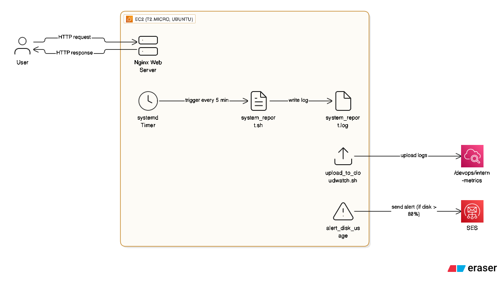
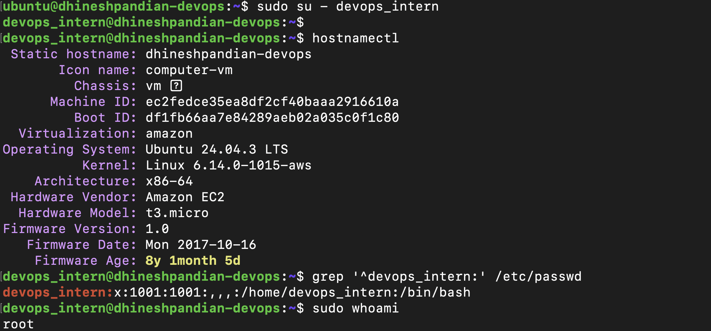
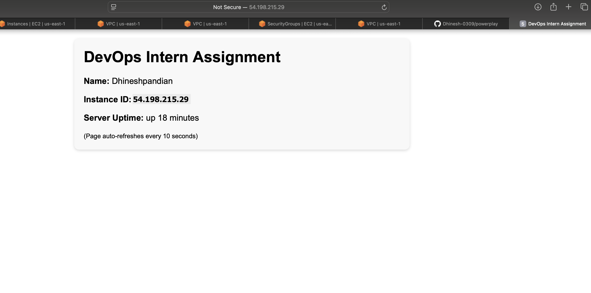
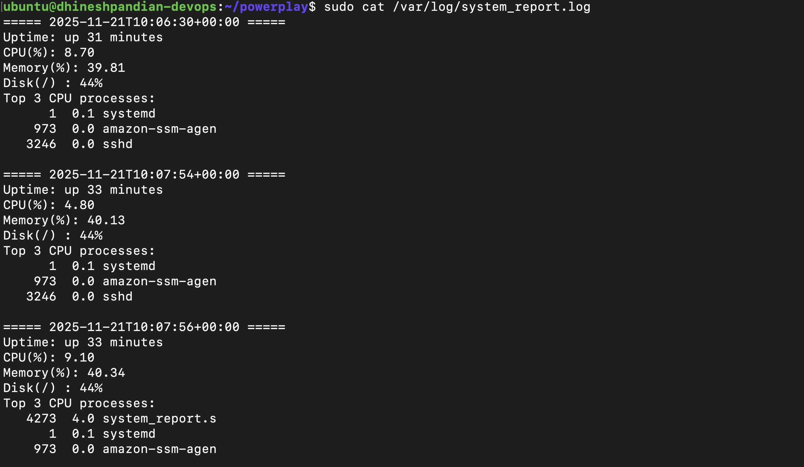
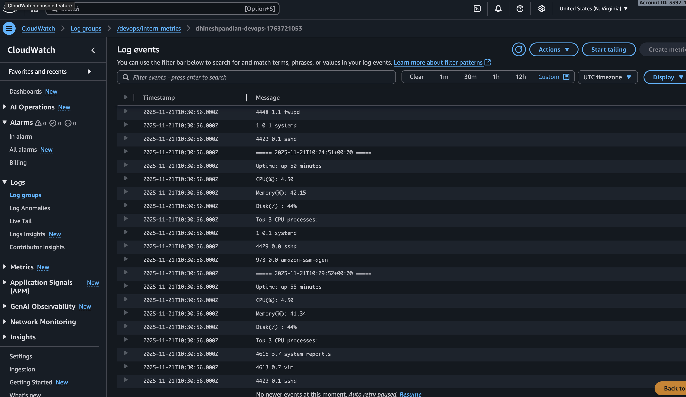
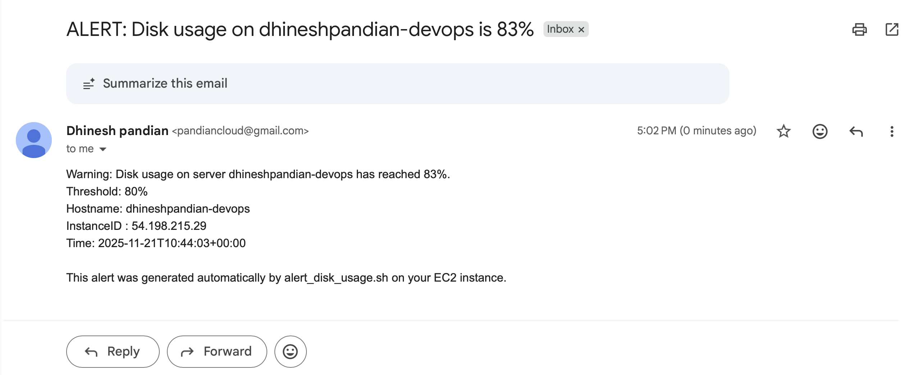

# DevOps Intern Assignment — Powerplay

<div align="center">


**Complete implementation**: EC2 system setup, Nginx web server, automated monitoring with systemd, CloudWatch Logs integration, SES-based disk alerts, and cleanup automation.

</div>

---

## 📋 Table of Contents

- [Overview](#-overview)
- [Architecture](#%EF%B8%8F-architecture)
- [Repository Structure](#-repository-structure)
- [Prerequisites](#-prerequisites)
- [Setup Instructions](#-setup-instructions)
  - [Part 1: System Setup](#part-1-system-setup)
  - [Part 2: Nginx Web Server](#part-2-nginx-web-server)
  - [Part 3: Monitoring & Systemd Timer](#part-3-monitoring--systemd-timer)
  - [Part 4: CloudWatch Integration](#part-4-cloudwatch-integration)
  - [Bonus: SES Disk Alerts](#bonus-ses-disk-alerts)
- [Cleanup](#-cleanup)
- [How to Stand Out](#-how-to-stand-out)
- [Troubleshooting](#-troubleshooting)
- [Author](#-author)

---

## 🎯 Overview

<details open>
<summary><b>Click to expand</b></summary>

This repository contains a complete solution for the DevOps Intern Assignment, demonstrating essential DevOps skills including:

- ✅ **Linux System Administration**: User management, sudo configuration, hostname customization
- ✅ **Web Server Deployment**: Nginx installation and dynamic content serving
- ✅ **Automation**: Shell scripting and systemd service/timer configuration
- ✅ **Cloud Integration**: AWS CloudWatch Logs and SES (Simple Email Service)
- ✅ **Monitoring**: Automated system metrics collection and alerting

</details>

### Assignment Components

| Part | Description | Script |
|:----:|:-----------|:-------|
| **Part 1** | Create `devops_intern` user with passwordless sudo and custom hostname | `scripts/setup_part1.sh` |
| **Part 2** | Deploy Nginx server displaying Name, Instance ID, and Uptime | `scripts/setup_part2.sh` |
| **Part 3** | System monitoring script with systemd timer (every 2 minutes) | `scripts/system_report.sh` |
| **Part 4** | Upload monitoring logs to AWS CloudWatch Logs | `scripts/upload_to_cloudwatch.sh` |
| **Bonus** | SES-based disk usage alerts (threshold: 80%) | `scripts/alert_disk_usage.sh` |
| **Cleanup** | Automated cleanup and resource removal | `scripts/cleanup.sh` |

---

## 🏗️ Architecture

<div align="center">



</div>

```
┌─────────────────────────────────────────────────────────────┐
│                        EC2 Instance                          │
│  ┌────────────────────────────────────────────────────────┐ │
│  │  • User: devops_intern (passwordless sudo)             │ │
│  │  • Hostname: powerplay-devops-YourName                 │ │
│  └────────────────────────────────────────────────────────┘ │
│                                                               │
│  ┌──────────────────┐      ┌──────────────────────────────┐ │
│  │  Nginx Server    │      │  Systemd Timer & Service     │ │
│  │  Port 80         │      │  (every 2 minutes)           │ │
│  │  Dynamic content │      │  → system_report.sh          │ │
│  └──────────────────┘      └──────────────────────────────┘ │
│           │                              │                    │
│           ↓                              ↓                    │
│   Shows: Name, ID,              /var/log/system_report.log   │
│          Uptime                          │                    │
└───────────────────────────────────────────┼────────────────────┘
                                            │
                         ┌──────────────────┴──────────────────┐
                         ↓                                      ↓
              ┌──────────────────────┐            ┌──────────────────────┐
              │  AWS CloudWatch Logs │            │    AWS SES           │
              │  /devops/intern-     │            │  (Disk Alerts > 80%) │
              │  metrics             │            └──────────────────────┘
              └──────────────────────┘
```

---

## 📁 Repository Structure

```
powerplay/
├── README.md
├── screenshots/
│   ├── PART_01.png              # System setup verification
│   ├── PART_02.png              # Nginx web page
│   ├── PART_03.png              # Monitoring logs
│   ├── PART_04.png              # CloudWatch Logs
│   ├── SES_ALERT.png            # SES email alert example
│   └── architecture.png         # Architecture diagram
├── scripts/
│   ├── setup_part1.sh           # User & hostname setup
│   ├── setup_part2.sh           # Nginx installation
│   ├── system_report.sh         # Monitoring script
│   ├── system_report.service    # Systemd service unit
│   ├── system_report.timer      # Systemd timer unit
│   ├── upload_to_cloudwatch.sh  # CloudWatch integration
│   ├── alert_disk_usage.sh      # SES disk alert
│   └── cleanup.sh               # Cleanup automation
└── config/
    ├── cloudwatch-config.json   # CloudWatch agent config
    └── ses-policy.json          # IAM policy for SES
```

---

## ✅ Prerequisites

<table>
<tr>
<td width="50%">

### 🖥️ Infrastructure Requirements
- **AWS EC2 Instance**: Ubuntu 22.04 or 24.04
- **Instance Type**: t2.micro (recommended)
- **Security Group Rules**:
  - Port 22 (SSH) - Your IP
  - Port 80 (HTTP) - 0.0.0.0/0
- **SSH Key Pair**: For instance access
- **AWS CLI v2**: Installed and configured

</td>
<td width="50%">

### 🔐 AWS Service Requirements
- **AWS Account** with appropriate permissions
- **IAM Role** or AWS CLI credentials
- **SES Setup** (for bonus part):
  - Verified sender email
  - Verified recipient email (if in sandbox)

</td>
</tr>
</table>

### Required IAM Permissions

<details>
<summary><b>Click to view IAM Policy JSON</b></summary>

```json
{
  "Version": "2012-10-17",
  "Statement": [
    {
      "Effect": "Allow",
      "Action": [
        "logs:CreateLogGroup",
        "logs:CreateLogStream",
        "logs:PutLogEvents",
        "logs:DescribeLogGroups"
      ],
      "Resource": "arn:aws:logs:*:*:log-group:/devops/*"
    },
    {
      "Effect": "Allow",
      "Action": [
        "ses:SendEmail",
        "ses:SendRawEmail"
      ],
      "Resource": "*"
    }
  ]
}
```

</details>

---

## 🚀 Setup Instructions

### Initial Setup

<table>
<tr>
<td>

**1. Clone the repository**

```bash
git clone https://github.com/Dhinesh-0309/powerplay.git
cd powerplay
```

</td>
</tr>
<tr>
<td>

**2. Make scripts executable**

```bash
chmod +x scripts/*.sh
```

</td>
</tr>
</table>

---

### Part 1: System Setup

> **Objective**: Create a `devops_intern` user with passwordless sudo access and set a custom hostname.

#### 🔧 Run the script:

```bash
sudo bash scripts/setup_part1.sh "Your Full Name"
```

#### 📝 What this does:
- ✅ Creates user `devops_intern`
- ✅ Configures passwordless sudo
- ✅ Sets hostname to `powerplay-devops-YourName`
- ✅ Creates home directory and sets proper permissions

#### ✔️ Verification:

```bash
# Switch to devops_intern user
sudo su - devops_intern

# Verify hostname
hostnamectl

# Check user exists
grep '^devops_intern:' /etc/passwd

# Test sudo without password
sudo whoami  # Should print 'root'
```

#### 📸 Expected Output:

<div align="center">



</div>

---

### Part 2: Nginx Web Server

> **Objective**: Deploy Nginx and serve a dynamic webpage showing your name, EC2 instance ID, and system uptime.

#### 🔧 Run the script:

```bash
sudo bash scripts/setup_part2.sh "Your Full Name"
```

#### 📝 What this does:
- ✅ Installs Nginx
- ✅ Creates a dynamic PHP page
- ✅ Installs PHP-FPM
- ✅ Configures Nginx to serve the page
- ✅ Starts and enables Nginx service

#### 🌐 Access the webpage:

```bash
# Open in browser
http://<YOUR_EC2_PUBLIC_IP>
```

#### 📸 Expected Output:

<div align="center">



**The webpage displays**: Your name • EC2 Instance ID • System uptime

</div>

---

### Part 3: Monitoring & Systemd Timer

> **Objective**: Create an automated monitoring script that logs system metrics every 2 minutes using systemd.

#### 🔧 Installation steps:

```bash
# Copy monitoring script
sudo cp scripts/system_report.sh /usr/local/bin/
sudo chmod +x /usr/local/bin/system_report.sh

# Install systemd service and timer
sudo cp scripts/system_report.service /etc/systemd/system/
sudo cp scripts/system_report.timer /etc/systemd/system/

# Reload systemd and enable timer
sudo systemctl daemon-reload
sudo systemctl enable --now system_report.timer
```

#### ✔️ Verify timer is active:

```bash
sudo systemctl status system_report.timer
sudo systemctl list-timers system_report.timer
```

#### 🧪 Force immediate execution (for testing):

```bash
sudo systemctl start system_report.service
sudo systemctl start system_report.service
```

#### 📊 View logs:

```bash
sudo tail -n 50 /var/log/system_report.log
```

#### 📸 Expected Output:

<div align="center">



**Log contains**: CPU usage • Memory usage • Disk usage • Top 5 processes

</div>

---

### Part 4: CloudWatch Integration

> **Objective**: Upload system monitoring logs to AWS CloudWatch Logs.

#### 🔧 Run the script:

```bash
# Set your AWS region
export AWS_REGION=us-east-1

# Upload logs to CloudWatch
sudo AWS_REGION=$AWS_REGION bash scripts/upload_to_cloudwatch.sh
```

#### 📝 What this does:
- ✅ Creates CloudWatch Log Group: `/devops/intern-metrics`
- ✅ Creates a Log Stream with timestamp
- ✅ Uploads all entries from `/var/log/system_report.log`
- ✅ Handles AWS authentication via IAM role or CLI

#### ✔️ Verify in AWS Console:

1. Navigate to: **CloudWatch → Logs → Log groups**
2. Find: `/devops/intern-metrics`
3. View log streams and entries

#### 📸 Expected Output:

<div align="center">



</div>

---

### Bonus: SES Disk Alerts

> **Objective**: Send email alerts via AWS SES when disk usage exceeds 80%.

#### 📋 Prerequisites:
- ✅ Verified sender email in SES
- ✅ Verified recipient email (if in sandbox mode)

#### ⚙️ Configuration:

Edit `scripts/alert_disk_usage.sh` and update:

```bash
EMAIL_FROM="your_verified_sender@example.com"
EMAIL_TO="your_verified_recipient@example.com"
AWS_REGION="us-east-1"
THRESHOLD=80  # Alert if disk usage > 80%
```

#### 🔧 Installation:

```bash
sudo cp scripts/alert_disk_usage.sh /usr/local/bin/
sudo chmod +x /usr/local/bin/alert_disk_usage.sh
```

#### 🧪 Test the alert (optional):

```bash
# Edit script and set THRESHOLD=1 for testing
AWS_REGION=us-east-1 sudo /usr/local/bin/alert_disk_usage.sh
```

#### ⏰ Schedule with cron (optional):

```bash
# Add to crontab to run every hour
sudo crontab -e

# Add this line:
0 * * * * /usr/local/bin/alert_disk_usage.sh
```

#### 📸 Expected Output:

<div align="center">



**Email contains**: Disk usage % • Instance ID • Hostname • Alert timestamp

</div>

---

## 🧹 Cleanup

<blockquote>
To remove all installed components and configurations:
</blockquote>

```bash
sudo bash scripts/cleanup.sh
```

### What this removes:
- ❌ Stops and disables systemd timer/service
- ❌ Removes monitoring scripts
- ❌ Deletes log files
- 📝 Provides commands for manual AWS resource cleanup

### Manual AWS cleanup (run these after the script):

```bash
# Delete CloudWatch Log Group
aws logs delete-log-group --log-group-name /devops/intern-metrics --region us-east-1

# Terminate EC2 instance (replace INSTANCE_ID)
aws ec2 terminate-instances --instance-ids INSTANCE_ID --region us-east-1
```

---


## 🔧 Troubleshooting

<details>
<summary><b>Common Issues and Solutions</b></summary>

### Issue: `sudo: no tty present and no askpass program specified`
**Solution**: Ensure you're running scripts with `sudo bash script.sh` not `bash script.sh`

---

### Issue: CloudWatch upload fails with permission denied
**Solution**: Verify IAM role has `logs:PutLogEvents` permission

```bash
# Check AWS credentials
aws sts get-caller-identity

# Verify IAM role permissions
aws iam get-role-policy --role-name YOUR_ROLE --policy-name YOUR_POLICY
```

---

### Issue: SES sends email but it's not received
**Solution**: 
1. Check spam folder
2. Verify both sender/recipient emails in SES
3. Check SES sending statistics in AWS Console

---

### Issue: Systemd timer not running
**Solution**: 

```bash
sudo systemctl daemon-reload
sudo systemctl enable --now system_report.timer
sudo systemctl status system_report.timer
sudo journalctl -u system_report.service -f
```

---

### Issue: Nginx shows 502 Bad Gateway
**Solution**: Ensure PHP-FPM is running:

```bash
sudo systemctl status php8.1-fpm
sudo systemctl restart php8.1-fpm nginx
sudo tail -f /var/log/nginx/error.log
```

---

### Issue: Script fails with "command not found"
**Solution**: Install missing dependencies:

```bash
# For AWS CLI
curl "https://awscli.amazonaws.com/awscli-exe-linux-x86_64.zip" -o "awscliv2.zip"
unzip awscliv2.zip
sudo ./aws/install

# For jq (JSON processor)
sudo apt update && sudo apt install -y jq
```

</details>

---

## 👤 Author

<div align="center">

### **Dhinesh**

[](https://github.com/Dhinesh-0309)
[](https://linkedin.com/in/pandian0114)

📧 **Email**: pandian0114@gmail.com  
🌐 **Linkedin**: https://www.linkedin.com/in/pandian0114/

</div>

---

## 📜 License

<div align="center">

This project is created for educational purposes as part of the DevOps Intern Assignment for Powerplay.

**Created**: November 21, 2025 | **Last Updated**: November 21, 2025

---


</div>
